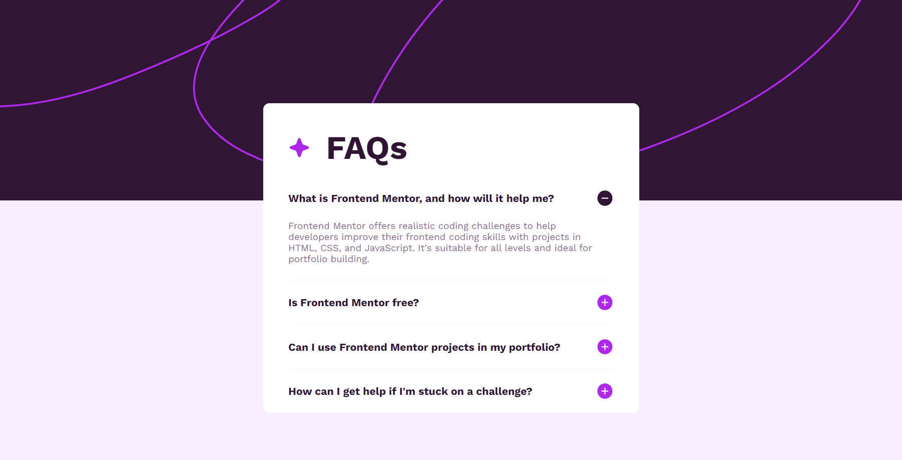

# Frontend Mentor - FAQ accordion solution

This is a solution to the [FAQ accordion challenge on Frontend Mentor](https://www.frontendmentor.io/challenges/faq-accordion-wyfFdeBwBz). Frontend Mentor challenges help you improve your coding skills by building realistic projects. 

## Table of contents

- [Overview](#overview)
  - [The challenge](#the-challenge)
  - [Screenshot](#screenshot)
  - [Links](#links)
- [My process](#my-process)
  - [Built with](#built-with)
  - [What I learned](#what-i-learned)
  - [Continued development](#continued-development)
  - [Useful resources](#useful-resources)
- [Author](#author)

## Overview

### The challenge

Users should be able to:

- Hide/Show the answer to a question when the question is clicked
- Navigate the questions and hide/show answers using keyboard navigation alone
- View the optimal layout for the interface depending on their device's screen size
- See hover and focus states for all interactive elements on the page

### Screenshot

### Links

- Solution URL: [Link](https://github.com/codebyveronica/FAQ-accordion)
- Live Site URL: [Link](https://codebyveronica.github.io/FAQ-accordion/)

## My process

### Built with

- Semantic HTML5 markup
- CSS custom properties
- Flexbox
- CSS Grid
- Mobile-first workflow
- JavaScript

### What I learned

I learned A LOT from this project. I wanted to get out of the tutorials and try to create something myself with what I already learned. It was difficult, it took a considerable amount of time and a lot of research between forums and libraries, but I did it. I'm so proud of my JS code. I really had no idea how to put all the elements together, but in the end, I managed to build the functionality I wanted. And this made me learn a lot about EventListener, target, and it was great practice with variables, functions and loops. Loops mainly because I didn't know before that it was possible to add EventListener through a ForEach.

### Continued development

I will build more projects with JavaScript, without leaving aside HTML and CSS. I want to be building big projects soon.

### Useful resources

- [W3Schools](https://www.w3schools.com) - It helped me a lot when researching with JS.

## Author

- Frontend Mentor - [@codebyveronica](https://www.frontendmentor.io/profile/codebyveronica)
